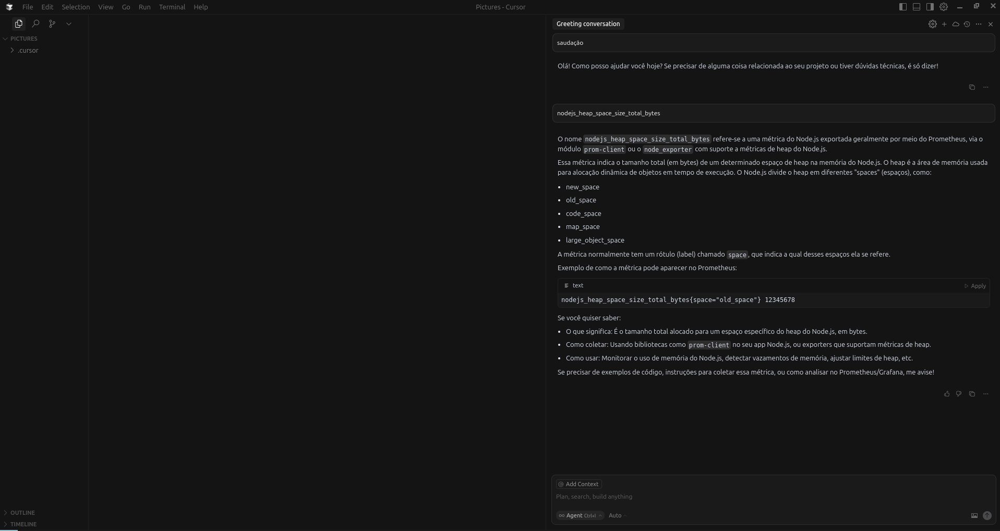

# prometheus-mcp-server



A Model Context Protocol (MCP) server for interacting with Prometheus metrics and data.

TypeScript-based MCP server implementing a Prometheus API interface. Bridges Claude and your Prometheus server via MCP.

## Features

- Instant and range PromQL queries
- Series and label discovery
- Metric metadata access
- Scrape target info
- Alerts, rules, and status endpoints

## Installation

```bash
npm install -g prometheus-mcp-server
# or
npm install prometheus-mcp-server
# or
npx prometheus-mcp-server
```

## Usage

Set the `PROMETHEUS_HOST` environment variable to your Prometheus instance URL.

Example Claude Desktop config:

```json
{
  "mcpServers": {
    "prometheus-mcp-server": {
      "command": "npx prometheus-mcp-server",
      "env": {
        "PROMETHEUS_HOST": "http://your-prometheus-instance:9090"
      }
    }
  }
}
```

## Functions

- `mcp__instant_query`
- `mcp__range_query`
- `mcp__get_series`
- `mcp__get_label_values`
- `mcp__get_metadata`
- `mcp__get_targets`
- `mcp__get_alerts`
- `mcp__get_rules`
- `mcp__get_status`

## Development

```bash
npm install
npm run build
npm start
```# prometheus-mcp-server
